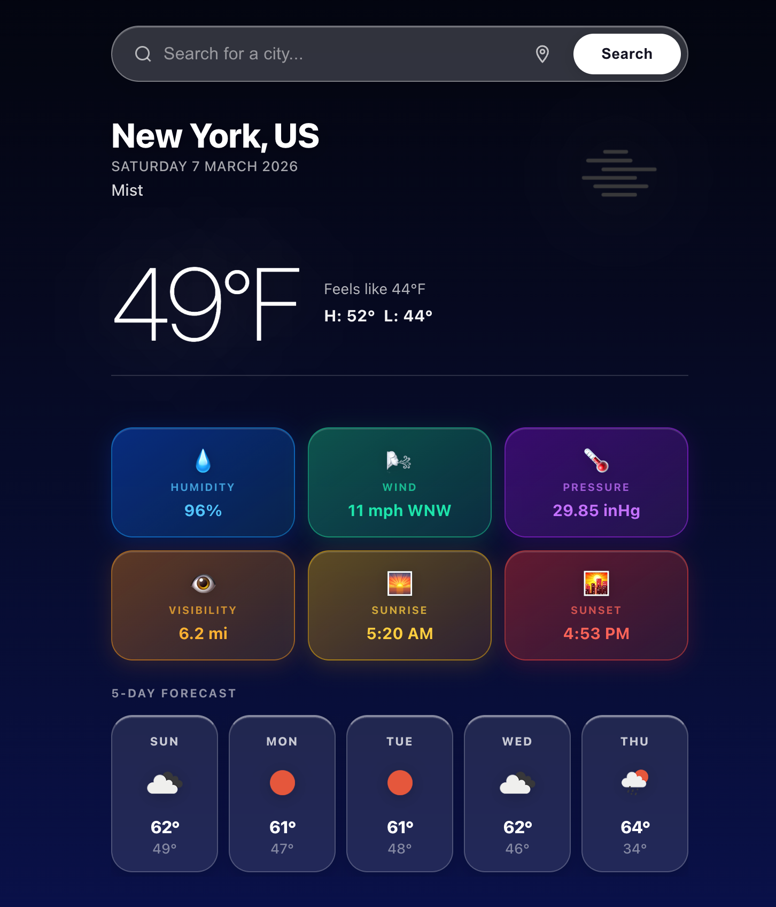

# Weather App

**Live demo → [weather-app-tau-orpin-82.vercel.app](https://weather-app-tau-orpin-82.vercel.app)**



A commercial-grade weather application built with React and TypeScript. Get real-time weather conditions, detailed metrics, and a 5-day forecast for any city worldwide — with automatic location detection and dynamic backgrounds that match the current weather.

---

## Features

- **Real-time weather** — current temperature, condition, feels like, daily high/low
- **5-day forecast** — grouped daily forecast with high/low temps and weather icons
- **Detailed metrics** — humidity, wind speed & direction, pressure, visibility, sunrise, sunset
- **Geolocation** — automatically loads local weather on first visit
- **Dynamic backgrounds** — gradient changes to match weather condition (clear, rain, clouds, snow, fog, thunder, night)
- **American/imperial units** — Fahrenheit, mph, inHg, miles
- **Responsive design** — works on mobile and desktop

---

## Tech Stack

- **React 18** with TypeScript
- **OpenWeatherMap API** — current weather + 5-day forecast endpoints
- **Pure CSS** — custom properties, glassmorphism, backdrop-filter, CSS animations
- **Create React App**

---

## Getting Started

### Prerequisites

- Node.js 16+
- An [OpenWeatherMap API key](https://openweathermap.org/api) (free tier works)

### Installation

```bash
git clone https://github.com/sh1vendra/Weather_App.git
cd Weather_App
npm install
```

### Environment Setup

Create a `.env` file in the project root:

```
REACT_APP_WEATHER_API_KEY=your_api_key_here
```

### Running the App

```bash
npm start
```

Opens at [http://localhost:3000](http://localhost:3000).

### Build for Production

```bash
npm run build
```

---

## Project Structure

```
src/
├── components/
│   ├── CurrentWeather/     # Main weather display (temp, icon, H/L)
│   ├── Forecast/           # 5-day forecast row
│   ├── SearchBar/          # City search with geolocation button
│   ├── WeatherDetails/     # 6-card metrics grid
│   └── WeatherIcon/        # OpenWeatherMap icon wrapper
├── hooks/
│   ├── useWeather.ts       # Fetch logic and state
│   └── useGeolocation.ts   # Browser geolocation
├── services/
│   └── weatherService.ts   # API calls
├── types/
│   └── weather.ts          # TypeScript interfaces
└── utils/
    └── formatters.ts       # Unit conversions and date formatting
```

---

## API

Uses the [OpenWeatherMap](https://openweathermap.org/api) REST API:

| Endpoint | Purpose |
|---|---|
| `/data/2.5/weather` | Current conditions |
| `/data/2.5/forecast` | 5-day / 3-hour forecast |

Both endpoints use `units=imperial` for Fahrenheit and mph.

---

## License

MIT
